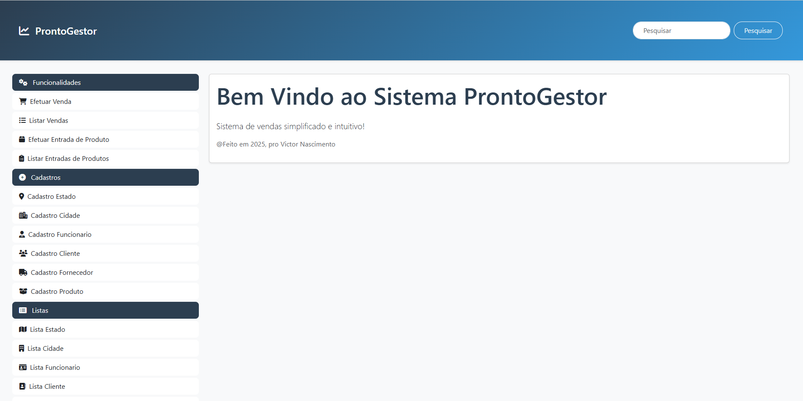

# 🚀 ProntoGestor - Sistema de Gestão Empresarial

<div align="center">
  
  
  
  
  
</div>

## 📋 Índice
- [Sobre o Projeto](#-sobre-o-projeto)
- [Funcionalidades](#-funcionalidades)
- [Tecnologias Utilizadas](#-tecnologias-utilizadas)
- [Estrutura do Projeto](#-estrutura-do-projeto)
- [Como Executar](#-como-executar)
- [Configuração do Banco de Dados](#-configuração-do-banco-de-dados)
- [Módulos do Sistema](#-módulos-do-sistema)
- [Screenshots](#-screenshots)
- [Contribuição](#-contribuição)
- [Licença](#-licença)

## 🎯 Sobre o Projeto

O **ProntoGestor** é um sistema de gestão empresarial completo desenvolvido para auxiliar empresas de todos os portes no controle de suas operações comerciais. Com uma interface moderna e intuitiva, o sistema oferece ferramentas essenciais para o gerenciamento de vendas, estoque, clientes, fornecedores e muito mais.

Este projeto foi desenvolvido utilizando as mais modernas tecnologias do mercado, garantindo performance, segurança e facilidade de uso.

## ✨ Funcionalidades

- **Gestão de Clientes**: Cadastro completo de clientes com informações detalhadas
- **Gestão de Fornecedores**: Controle de fornecedores e suas informações de contato
- **Gestão de Produtos**: Cadastro de produtos com controle de estoque e preços
- **Controle de Vendas**: Registro de vendas com cálculo automático de valores
- **Controle de Entradas**: Registro de entradas de produtos com atualização automática do estoque
- **Gestão de Funcionários**: Cadastro e controle de funcionários
- **Gestão de Cidades e Estados**: Cadastro de localidades para uso em endereços
- **Interface Responsiva**: Adaptável a diferentes dispositivos e tamanhos de tela
- **Dashboard Intuitivo**: Visualização rápida das informações mais importantes

## 🛠️ Tecnologias Utilizadas

- **Backend**:
  - Java 17
  - Spring Boot 2.7.12
  - Spring Data JPA
  - Spring MVC
  - Thymeleaf (Template Engine)

- **Frontend**:
  - HTML5
  - CSS3
  - JavaScript
  - Bootstrap 5.3.0
  - Font Awesome 6.4.0

- **Banco de Dados**:
  - PostgreSQL
  - Hibernate (ORM)

- **Ferramentas**:
  - Maven (Gerenciamento de Dependências)
  - Git (Controle de Versão)

## 📁 Estrutura do Projeto

```
sistema protótipo/
├── src/
│   ├── main/
│   │   ├── java/
│   │   │   └── com/projeto/sistema/
│   │   │       ├── controle/         # Controladores da aplicação
│   │   │       ├── modelos/          # Entidades do sistema
│   │   │       ├── repositorios/     # Repositórios JPA
│   │   │       ├── SistemaApplication.java
│   │   │       └── configuracaoBancoDeDados.java
│   │   └── resources/
│   │       └── templates/
│   │           └── administrativo/   # Templates Thymeleaf
│   │               ├── clientes/
│   │               ├── fornecedores/
│   │               ├── produtos/
│   │               ├── vendas/
│   │               ├── entradas/
│   │               ├── funcionarios/
│   │               ├── cidades/
│   │               ├── estados/
│   │               └── home.html
│   └── test/                         # Testes automatizados
├── pom.xml                           # Dependências Maven
└── README.md
```

## 🚀 Como Executar

### Pré-requisitos

- Java 17 ou superior
- Maven 3.6 ou superior
- PostgreSQL 14 ou superior
- Git

### Passos para Execução

1. **Clone o repositório**
   ```bash
   git clone https://github.com/VictorNascimento14/ProntoGestor
   cd prontogestor
   ```

2. **Configure o banco de dados**
   - Crie um banco de dados PostgreSQL chamado `loja`
   - Ajuste as credenciais no arquivo `configuracaoBancoDeDados.java` se necessário

3. **Compile o projeto**
   ```bash
   mvn clean install
   ```

4. **Execute a aplicação**
   ```bash
   mvn spring-boot:run
   ```

5. **Acesse o sistema**
   - Abra seu navegador e acesse `http://localhost:8080`

## 💾 Configuração do Banco de Dados

O sistema utiliza PostgreSQL como banco de dados. As configurações padrão são:

- **URL**: jdbc:postgresql://localhost:5432/loja
- **Usuário**: postgres
- **Senha**: 123456

Para alterar essas configurações, edite o arquivo `configuracaoBancoDeDados.java`.

## 📊 Módulos do Sistema

### 1. Gestão de Clientes
- Cadastro completo de clientes
- Informações de contato e endereço
- Histórico de compras

### 2. Gestão de Fornecedores
- Cadastro de fornecedores
- Informações de contato e endereço
- Histórico de fornecimento

### 3. Gestão de Produtos
- Cadastro de produtos
- Controle de estoque
- Preços de custo e venda
- Código de barras

### 4. Controle de Vendas
- Registro de vendas
- Cálculo automático de valores
- Histórico de vendas por cliente
- Relatórios de vendas

### 5. Controle de Entradas
- Registro de entradas de produtos
- Atualização automática do estoque
- Histórico de entradas

### 6. Gestão de Funcionários
- Cadastro de funcionários
- Informações de contato e endereço
- Histórico de vendas por funcionário

### 7. Gestão de Cidades e Estados
- Cadastro de estados
- Cadastro de cidades
- Vinculação de cidades a estados

## 📸 Screenshots

*[Adicione screenshots do sistema aqui]*

## 🤝 Contribuição

Contribuições são sempre bem-vindas! Sinta-se à vontade para abrir issues, sugerir melhorias ou enviar pull requests.

1. Faça um fork do projeto
2. Crie uma branch para sua feature (`git checkout -b feature/AmazingFeature`)
3. Commit suas mudanças (`git commit -m 'Add some AmazingFeature'`)
4. Push para a branch (`git push origin feature/AmazingFeature`)
5. Abra um Pull Request

## 📄 Licença

Este projeto está sob a licença MIT. Veja o arquivo [LICENSE](LICENSE) para mais detalhes.

---

<div align="center">
  <p>Desenvolvido com ❤️ por Victor Nascimento</p>
  <p>
    <a href="https://github.com/seu-usuario">GitHub</a> •
    <a href="https://linkedin.com/in/seu-usuario">LinkedIn</a>
  </p>
</div>
